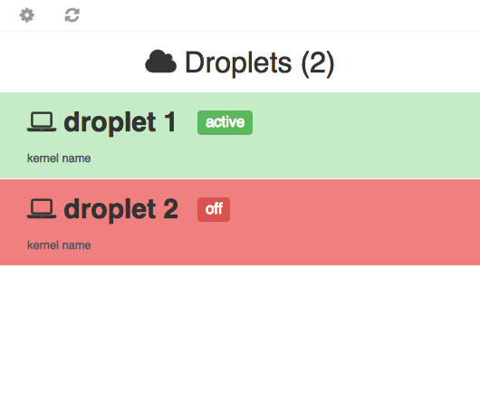

# Droplets: a simple Digital Ocean Droplet manager

Experimental hybrid app (HTML/JS wrapped in a native app with WKWebview), build with Swift.
I chose to use the Digital Ocean API as a use case.

Idea:

- Run local webserver in nodejs, which serves static files
- Load static site, build with AngularJS, from webview

The app shows your Digital Ocean droplets.

Consider this an alpha version. This project is not activly maintained. I make no guarantees or warranties whatsoever.

##Building/Running

- Make sure NodeJS is installed and runnable from `/usr/local/bin/node`. A NodeJS script serves statics files to the WKWebview in the app.
- Build the project in XCode.
- After startup, you need to enter your Digital Ocean oAuth token in the settings screen (cog wheel icon). You need a token with read+write access.

##Thanks to

- [practicalswift.com](http://practicalswift.com/2014/06/27/a-minimal-webkit-browser-in-30-lines-of-swift/) for webview tutorial in Swift.
- [Santosh Rajan](https://medium.com/swift-programming/http-in-swift-693b3a7bf086) for tutorial on HTTP/JSON requests in Swift

##Similar

Similar (and more mature :) ) projects:

- [node-webkit](https://github.com/rogerwang/node-webkit): "write native apps in HTML and JavaScript
- [atom-shell](https://github.com/atom/atom-shell): "cross-platform desktop applications using JavaScript, HTML and CSS"
- [MacGap](https://github.com/MacGapProject): "Desktop WebKit wrapper for HTML/CSS/JS applications."

##Attributions/Credits

- Icon "Drop" by Márcio Pinhole from The Noun Project, licensed under Creative
Commons Attribution